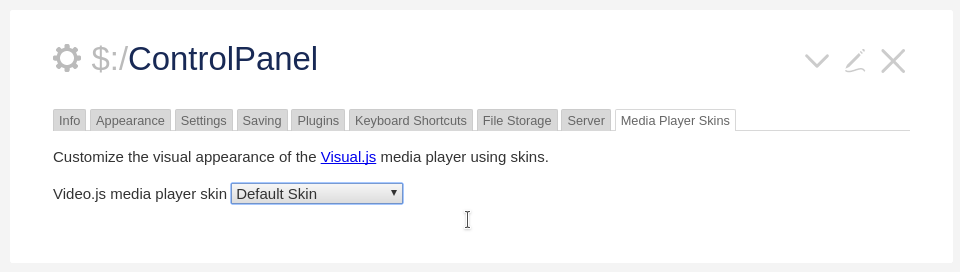

# Video.js Media Player for TiddlyWiki&nbsp;5

Simply download the <i class="fas fa-download"/>&nbsp;[TwTube plugin](output/twtube.tid)
and then drag and drop it into your TiddlyWiki in order to enjoy the
<i class="fas fa-external-link-alt"/>&nbsp;[Video.js Media Player](https://videojs.com/).

Wait, there's more:
* customize the visual appearance of the media player with **skin plugins**.
* enhance the media player functionality using **Videojs plugins**.

# Live Demonstration

Take a <i class="fas fa-eye"/>&nbsp;[live tour](https://thediveo.github.io/TwTube/output/twtube.html)
to see how TwTube works. And learn more about how to use the TwTube plugin in
your own TiddlyWikis.

# Skin Plugins

The following additional player skins are available as individual TiddlyWiki&nbsp;5 plugins.
Simply drop one or more of them into your TiddlyWiki. You can then easily switch
between the installed media player skins at any time in control panel, using the new
**Media Player Skins** tab.

| Skin | Screenshot |
| ---- | -------- |
| iPlayer-inspired |  |
| Sublime-inspired |  |
| YouTube-inspired |  |

# Videojs Plugins

The following functional Video.js enhancements are currently available for TwTube:

* **persistent volume** stores your volume+mute settings in your browser
  storage. This plugin is already included in the base TwTube plugin.
* **hotkeys** for play/pause, forward, rewind, et cetera.

Simply download the corresponding plugins, then drop them into your TiddlyWiki
together with the TwTube plugin.
