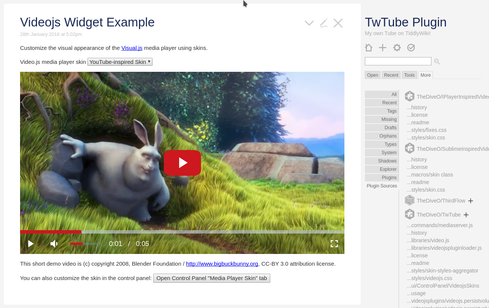
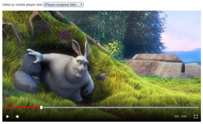
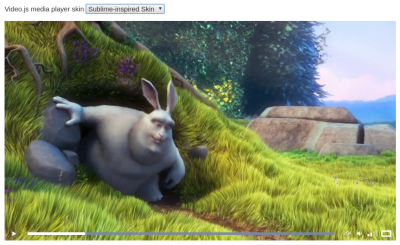

# Video.js Media Player for TiddlyWiki5

Simply install this [TwTube plugin](https://github.com/TheDiveO/TwTube/releases/latest)
to bring the [Video.js Media Player](https://videojs.com/)
to [TiddlyWiki5](https://tiddlywiki.com/).

Wait, there's more:
* customize the visual appearance of the media player with **skin plugins**.
* enhance player functionality using Video.js plugins.

## Skin Pugins

The following additional player skins are available as plugins:

| Skin | Showcase |
| ---- | -------- |
| iPlayer-inspired |  |
| Sublime-inspired |  |
| YouTube-inspired |  |

## Videojs Plugins

The following functional enhancements are currently available:

* **persistent volume** stores your volume+mute settings in your browser
  storage. This plugin is already included in the base TwTube plugin.
* **hotkeys** for play/pause, forward, rewind, et cetera.

# Live Demonstration

Take a [live tour](https://thediveo.github.io/TwTube/output/twtube.html) to see how TwTube
works. And learn more about how to use the TwTube plugin in your own TiddlyWikis.
